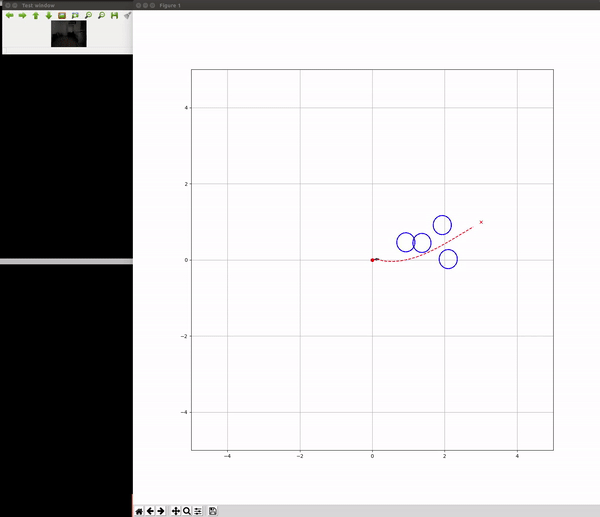

# Autonomous Driving Pipeline in ROS

## User Guide

<center>

Mobile Robot                |  ROS Pipeline
:-------------------------: |:-------------------------:
 | 

</center>

### Quick Start

First of all, we need to clone all the ```./src``` folder inside a new ROS folder:

```shell
mkdir ROS_AD_pipeline
cd ROS_AD_pipeline
git clone https://github.com/cconejob/Autonomous_driving_pipeline.git
```

Once we have installed all dependencies (see subsection below), we need to build the ```devel``` and ```build``` folders by typing inside the ```ROS_AD_pipeline``` folder:

```shell
catkin_make
```

If the command ```catkin_make``` fails, try executing it again and check if the percentage is growing.

In the same folder, type the following command before launching all packages.

```shell
source devel/setup.bash
```

Now, we are ready to launch:

```shell
roslaunch loomo Loomo.launch
```

### Structure

```
Autonomous Pipeline
│
│─── Loomo ───> Package which contains the launch file with all configurable parameters.
│
│─── Message Types ───> Package which includes all types of messages for topics.
│
│─── Perception ───> Package and node to perceive and detect from cameras and depth sensors.
│
│─── Estimation ───> Package to estimate current state from sensors information.
│       │
│       │─── Robot State ───> Node to estimate the state from IMU and GPS.
│       │
│       └─── Map State ───> Node to generate a map and estimate the state from all sensors.
│
│─── Prediction ───> Package and node to generate future positions (motion) for detections.
│
│─── Path Planning ───> Package and node to calculate robot's desired path to avoid collision.
│
│─── Control ───> Package and node to ensure that the robot is following the desired path.
│
└─── Visualization ───> Plotting tools for all nodes current data.
```

## Dependencies

### Ubuntu

* **Version 16.04:** https://releases.ubuntu.com/16.04/

### Python

We strongly recommend to install both versions: python 2 and 3.

* **Version 2.7:** https://tecadmin.net/install-python-2-7-on-ubuntu-and-linuxmint/

* **Version 3.7:** https://websiteforstudents.com/installing-the-latest-python-3-7-on-ubuntu-16-04-18-04/

### ROS Kinetic

* **Kinetic:** http://wiki.ros.org/kinetic/Installation/Ubuntu

### OpenCV

* **Version 3.3:** https://gist.github.com/danigosa/367b8a8cbc8d883df80c5c071423e4b2

### Openpifpaf

* **Version 0.11.9:** https://pypi.org/project/openpifpaf/

### TrajNet++
Follow instructions on https://thedebugger811.github.io/posts/2020/03/intro_trajnetpp/

* **trajnetplusplusbaselines**
* **trajnetplusplusdataset**
* **trajnetv**

### Other modules

We present other modules, which are required for our ROS pipeline.

* **math**

```shell
pip install python-math
```

* **numpy**

```shell
pip install numpy
```

* **scipy**

```shell
pip install scipy
```

* **matplotlib**

```shell
pip install matplotlib
```

* **PIL**

```shell
python3 -m pip install Pillow
```

* **torch 1.7.1**

```shell
pip install torch
```

* **collections**

```shell
pip install collections-extended
```

* **cython 0.29.21** 

```shell
pip install Cython
```