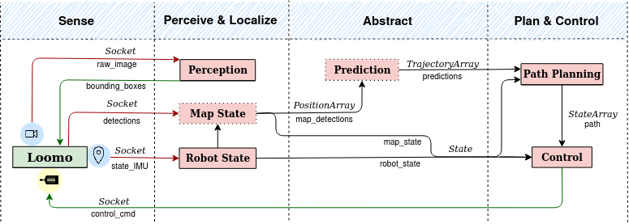

# ROS Packages Summary 

We present a brief explanation of all ROS packages we use for the **Autonomous Driving Pipeline**. We remind all users that this pipeline is designed to be flexible, and this means that modifying algorithms inside packages should not affect the robustness of the structure. 

All different ROS nodes are explained with a diagram, which structure is shown below:

**ROS Structure**

After the short description, we show how we connect all different nodes and the topics used:

* We represent the mobile robot (Segway Loomo in the project) in a **green rectangle**, with sensors and motors.

* In **red rectangles**, all nodes of the ROS structure. 
  * If the contour is continuous, it means that the node is essential for the pipeline to work. 
  * If the contour is discontinuous, its use is optional depending on the user's needs.

* All **connections** represent the data flow between different pillars.
  * In red, data acquired from the autonomous vehicle.
  * In green, data received by the mobile robot.
  * In black, all topics inside the ROS pipeline.

## Loomo

In this package, the user can change the main parameters of the pipeline. It includes the launch file that enables running all nodes at the same time. 

In this project, we used a Loomo Segway robot. Anyway, the structure could be implemented in other autonomous vehicles.

## Perception

The package's main goal is to detect objects, animals or humans (depending on the detector used) inside raw images from the robot and send bounding boxes to the Loomo.

We implement a simple **Minion** images detector and a complex human detector, called **Openpifpaf**.

## State Estimation

The state can be acquired more accurately than the sensor's data using estimation algorithms. We also give the possibility of storing a map that contains all previous observations with the last observation.

**Extended Kalman Filters** (with kinematic model) and **Data Association** (mapping) are included inside the package.

## Prediction

We predict the detections' future positions inside this package, depending on their motion during the last frames. The user can change the predictor algorithm depending on the requirements.

We include simple **Linear Predictor** and **TrajNet++** in the pipeline.

## Path Planning

The main goal is to design a path for the mobile robot to avoid object collision, follow a person, etc.

In this project, we use **Prediction RRT*** to avoid object collision going from a start point to a goal, considering the observations' possible motion.

## Control

In the Control package, we design an algorithm to follow the previously calculated desired path. 

We implemented a **Model Predictive Control** with a kinematic model.

## Message Types

It contains all types of messages for the different topics we need for the pipeline.

## Visualization

Finally, we visualize the essential ROS topics in order to check if all algorithms are working correctly. 

