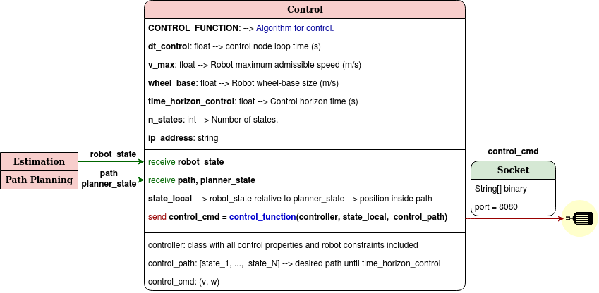

# Control

<center>


</center>

## control.py

<center>



</center>

### Control method

The controller's main goal is to follow the desired path until the user's goal. We have implemented two different Model Predictive Control methods, one designed in the VITA laboratory (kinematic), and the other in the EPFL Racing Team (dynamic).

Both of them require a common initialization step in order to set the mobile robot's constraints required:

```python
loomo = classes.MobileRobot(wheel_base, v_max)
```

* **Kinematic Model Predictive Control (Default)**

First of all, we need to configure the MPC with all parameters:

```python
mpc = MPC_Control.MPC(loomo, dt_control, control_prediction_horizon)
```

Then, in every iteration, we need to find in what position (local coordinates) of the desired path we are:

```python
state_local = transformations.Global_to_Local(planner_state, [robot_state])[0]
```

Finally, we calculate the optimal control commands and the future states with a solver (we use ```scipy.optimize.minimize(method="SLSQP")```).

```python
control_cmd, predicted_states_local = MPC_Control.mpc_control_loomo(mpc, state_local, desired_path_local)
```


* **Dynamic Model Predictive Control (EPFL Driverless)**

Initially, we set all controller parameters:

```python
mpc = MPC_Eloi.MPC_model()
```

Afterwards, as in the kinematic MPC, we need to find in what position of the desired path we are:

```python
state_local = transformations.Global_to_Local(planner_state, [robot_state])[0]
```

As the class ```MPC``` design is different, before running the solver, we first need to add the path into the class. Finally, the solver and the method used is the same as in the kinematic one.

```python
mpc.acquire_path(desired_path_global)
control_cmd, predicted_states_global = mpc.run_MPC(actual_state)
```

