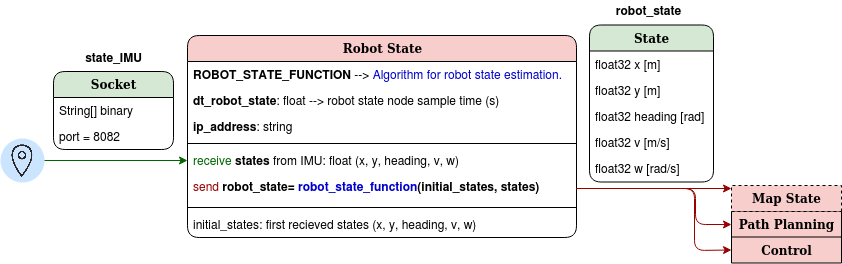
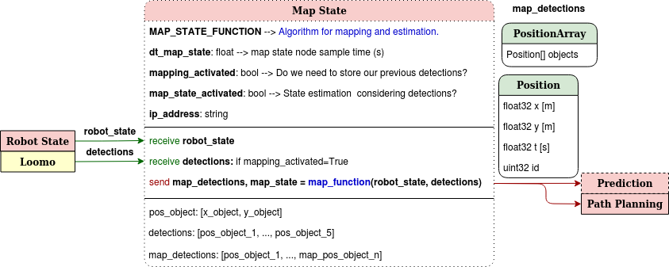

# ROS Structure

<center>


</center>

## Perception

**1. Detector initialization:** Modify parameters if a new detector is set.
``` python 
# Initialize Detector Configuration --> Loomo received image dimensions: 80x60x3
detection_image = DetectorConfig(width = w, height = h,
                                            channels = c, downscale = d,
                                            global_path = 'path',
                                            detector = detector_class()) 
```

**2. Receive image** from Loomo via Socket.

**3. Detector function Requirements**: 
| Variable                             | Input/Output        | Description                 | Example                |
| :----:                               | :------:            | :-----:                     | :-------:              |
| opencvImage                       | Input               | List of data_size RGB data  | [255, 5, 8, 157, 255, 0, ...]  |
| bbox_list                            | Output              | List of bounding boxes      |[[x<sub>center</sub>, y<sub>center</sub>, width, height]<sub>1</sub>, ...].|
| label_list                           | Output              | List of labels              | [label<sub>1</sub>, ...]   |

``` python
def detect(self, received_image):
    pil_image = Image.frombytes('RGB', (width/downscale, height/downscale), received_image)
    opencvImage = cv2.cvtColor(np.array(pil_image), cv2.COLOR_RGB2BGR)
    opencvImage = cv2.cvtColor(opencvImage,cv2.COLOR_BGR2RGB)
    bbox_list, bbox_label = detector.forward(opencvImage)
```

**4. perception.launch**
Change the IP address and the time period of perception if needed:
``` html
<param name="ip_address" value="" />
<param name="dt_perception" value="" />
```

### Software Architecture

<center>


</center>

## Robot State

<center>



</center>

## Map State

<center>



</center>

## Prediction

<center>


</center>

## Path Planning

<center>


</center>

## Control

<center>


</center>

