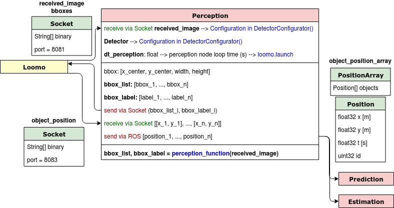

# Perception

<center>



</center>

## Detector

We offer two different detectors, built by VITA laboratory: 
* **Default:** Minion images detector. https://github.com/vita-epfl/socket-loomo/blob/master/python/detector.py
* **Openpifpaf:** Human detector. https://github.com/vita-epfl/openpifpaf

| Detector Name     | (w, h, c)     | dt_perception     | dt_control        | time_horizon_control  | type_input    |
| :----:            | :------:      | :------:          | :------:          | :------:              | :------:      |
| Default           | (80, 60, 3)   | $0.1 s$           | $0.2 s$           | $1 s$                 | $opencv$      |
| Openpifpaf        | (161, 107, 3) | $0.25 s$          | $0.5 s$           | $3 s$                 | $pil$         |

All real time detectors can be added inside the pipeline, setting the required parameters.

``` python 
detection_image = DetectorConfig(width=w, height=h, channels=c, downscale=d,
                                        global_path='path', detector=detector_class(),
                                        load=bool, type_input=t) 
```
Where ```width```, ```height``` and ```channels``` are the sizes expected by ```detector```, and ```downscale``` is the resize relation between detection size product $(w·h·c)$ and Loomo camera size multiplication $(80·60·3)$. If we need to load a model for the detector, we use parameter ```load=True ``` and we add set ```global_path='path_to_model'```. ```type_input``` depends on detector's input requirements, usually varying between $opencv$ and $pil$ modules.

Finally, in every iteretion, attribute ```detect``` from class ```DetectorConfig``` is used in order to output bounding boxes and labels with the remarked observations. 

``` python
bbox_list, label_list = detection_image.detect(received_image)
```


