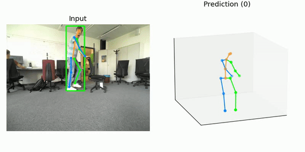

# Perception

## perception.py

<center>


</center>

## Description

The perception module is based on a multi-stage perceptor class. It provides Top-Down 3D Pose Estimation based on Detection and Tracking. Furthermore, we designed our perception module to be modular meaning that we can later easily change every stage of the perceptor.

### Detector


* **Yolov5** Object Detection architecture pretrained on COCO dataset, Multiple model size available. Inference time for medium size model ~20ms. We restrict the object detection to the Human class.


### Tracker

* **Stark** Learning Spatio-Temporal Transformer for Visual Tracking. (SOT) Single Object Tracker. Robustly track the initial target across frames. Inference time ~20ms.


### 3D Keypoints

* **VideoPose3D** 3D human pose estimation in video with temporal convolutions and semi-supervised training. Trained on Human3.6M dataset. 3D keypoints from 2D image. Inference time > 100 ms



## Creating Perceptor Object (Doc not updated)

All real time detectors can be added inside the pipeline, setting the required parameters.

``` python 
detection_image = DetectorConfig(width=w, height=h, channels=c, downscale=d,
                                        global_path='path', detector=detector_class(),
                                        load=bool, type_input=t) 
```

Where ```width```, ```height``` and ```channels``` are the sizes expected by ```detector```, and ```downscale``` is the resize relation between detection size product _(w·h·c)_ and Loomo camera size multiplication _(80·60·3)_. If we need to load a model for the detector, we use parameter ```load=True ``` and we add set ```global_path='path_to_model'```. ```type_input``` depends on detector's input requirements, usually varying between _opencv_ and _pil_ modules.

Finally, in every iteretion, attribute ```detect``` from class ```DetectorConfig``` is used in order to output bounding boxes and labels with the remarked observations. 

``` python
bbox_list, label_list = detection_image.detect(received_image)
```

## Downloading pretrained models

### Detection
[Yolov5](https://github.com/ultralytics/yolov5):
    Automatic Download implemented

(Not Yet Implemented)
[Yolov7](https://github.com/WongKinYiu/yolov7): Trainable bag-of-freebies, State-of-the-art object detector
    cd src/PostureTrack/detectors/weights
    wget https://github.com/WongKinYiu/yolov7/releases/download/v0.1/yolov7-tiny.pt
    wget https://github.com/WongKinYiu/yolov7/releases/download/v0.1/yolov7.pt
    wget https://github.com/WongKinYiu/yolov7/releases/download/v0.1/yolov7x.pt

### Tracking

Create a directory to store the pretrained tracker weights:
    
    cd src/perception/scripts/trackers
    mkdir weights 
#### SOT
[Stark](https://github.com/open-mmlab/mmtracking/tree/master/configs/sot/stark): Learning Spatio-Temporal Transformer for Visual Tracking

    cd src/perception/trackers/weights
    wget https://download.openmmlab.com/mmtracking/sot/stark/stark_st2_r50_50e_lasot/stark_st2_r50_50e_lasot_20220416_170201-b1484149.pth

:warning: Not implemented Yet

[SiameseRPN++](https://github.com/open-mmlab/mmtracking/tree/master/configs/sot/siamese_rpn):  Evolution of Siamese Visual Tracking With Very Deep Networks

    wget https://download.openmmlab.com/mmtracking/sot/siamese_rpn/siamese_rpn_r50_1x_lasot/siamese_rpn_r50_20e_lasot_20220420_181845-dd0f151e.pth
#### MOT
:warning: not implemented yet

[ByteTrack](https://github.com/open-mmlab/mmtracking/tree/master/configs/mot/bytetrack)

    wget https://download.openmmlab.com/mmtracking/mot/bytetrack/bytetrack_yolox_x/bytetrack_yolox_x_crowdhuman_mot17-private-half_20211218_205500-1985c9f0.pth

### Pose 2D

Create a directory to store the pretrained pose estimation weights:
    
    cd src/perception/scripts/keypoints
    mkdir weights 

:warning: Not implemented Yet

[DeepPose]()

    cd src/perception/keypoints/weights
    wget https://download.openmmlab.com/mmpose/top_down/deeppose/deeppose_res152_coco_384x288_rle-b77c4c37_20220624.pth

[HrNet]()

    wget https://download.openmmlab.com/mmpose/top_down/hrnet/hrnet_w48_coco_256x192-b9e0b3ab_20200708.pth


### Pose 3D

[VideoPose Human3.6M]()

    cd src/PostureTrack/keypoints/weights
    wget "https://download.openmmlab.com/mmpose/body3d/videopose/videopose_h36m_243frames_fullconv_supervised_cpn_ft-88f5abbb_20210527.pth"


